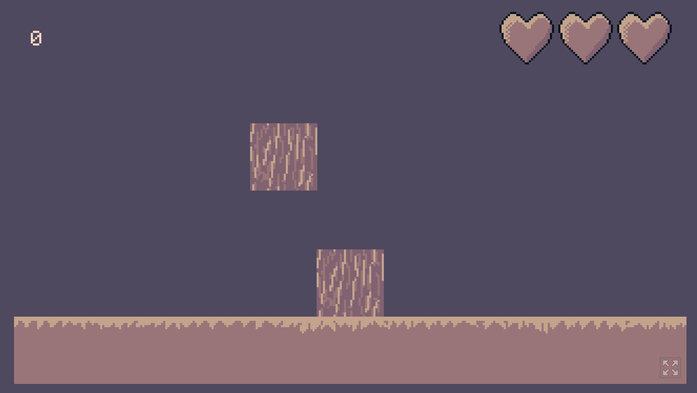

Tallest Tree Bot
================

This is a little bot I wrote as a means to learn a bit about
how screen capturing works in python.

How it Works
============

Tallest Tree is a simple little [game](https://legiongames.itch.io/tallest-tree)
that follows a familiar premise. A small bit of tree trunk 
oscillates back and forth on screen and the goal is to stack the
trunk pieces as high as possible.

If you miss the piece you're aiming for, your next piece will be
smaller based on how badly you missed.

The python script is basically taking screenshots constantly
and is analyzing the color data in them. If it detects anything 
other than `(94, 73, 78, 255)`, it tells your computer to press
the space bar.

We also dynamically alter the allowed time between
space presses since the screen scrolls up as you go and the logs
move faster over time. The first few blocks are weird so they have
they're own dedicated timers.

How to Use
==========
Be aware, this thing *barely* works and I'm not sure how it'll 
work on your setup but the times I'm using seem to work well.

First, get yourself a `venv` and `pip install .` the deps.
Then, run `python main.py`, click over to the game window and
press "play". Be sure that you're not playing in full-screen.

**Note**: Your computer might yell at you that terminal or whatever
needs permission to take over your computer. On a mac, this is 
managed in your "Security and Privacy" panel. You can see the
source code so you know I'm not doing anything nefarious but
always make changes to this crap at your own risk.

Troubleshooting
===============
Yeesh you actually tried to use this? Okay so here are some things
you might need to tune if this doesn't work immediately:

1. Makes sure the pixels the script is watching are lined up
horizonally with the right edge of the starting block. On a mac,
you can get your pixel coordinates by using the snipping tool
(cmd + control + shift + 4 and esc gets you out of the tool)
1. If blocks are being dropped too earlier, it's probably a sign
that the sleep timing is off; if the time is too short, the script
will detect the block that's falling (this is because I was lazy
and the pixel window doesn't change over time)
1. If blocks are dropping too late, you're probably lagging. If 
you're using the `debug_menu`, turn it off and see if that fixes
the issue
1. Clouds. Yeah clouds start around the 7th block I think? I'm not
filtering those colors out. I said I got bored...
